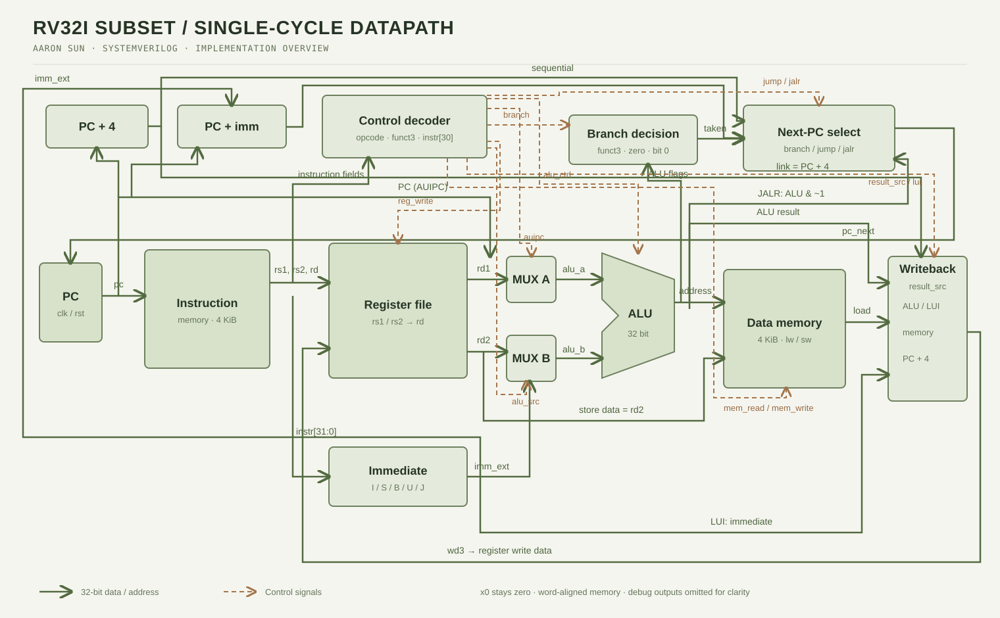
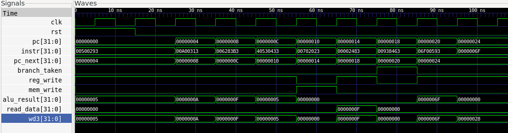

# RV32I-Subset Single-Cycle RISC-V CPU

A synthesizable educational 32-bit RISC-V single-cycle CPU written in SystemVerilog.

The design executes one instruction per clock cycle in simulation. It includes a program counter, instruction memory, control decoder, register file, immediate generator, ALU, data memory, and writeback logic.

## Architecture



Implementation overview derived from `rtl/cpu_top.sv`. Solid green lines carry data; solid orange lines carry control signals. Matching signal labels denote the same net, and dots mark connected junctions. Debug outputs are omitted for clarity.

[Edit the diagram in draw.io](docs/images/cpu-datapath.drawio) | [PNG image](docs/images/cpu-datapath.png)

## Supported ISA Subset

| Instruction group | Implemented instructions |
|---|---|
| Register ALU | `add`, `sub`, `sll`, `slt`, `sltu`, `xor`, `srl`, `sra`, `or`, `and` |
| Immediate ALU | `addi`, `slti`, `sltiu`, `xori`, `ori`, `andi`, `slli`, `srli`, `srai` |
| Memory | `lw`, `sw` |
| Branch | `beq`, `bne`, `blt`, `bge`, `bltu`, `bgeu` |
| Jump | `jal`, `jalr` |
| Upper immediate | `lui`, `auipc` |

## Current Scope and Limitations

This is an RV32I **subset**, not a complete production RV32I implementation.

- 32-bit integer datapath.
- Single-cycle execution model.
- 4 KiB instruction memory and 4 KiB data memory.
- Word-aligned 32-bit instruction fetches and data accesses.
- Only `lw` and `sw` are supported; byte and halfword loads/stores are not implemented.
- No CSR, SYSTEM, FENCE, interrupt, exception, or misaligned-access handling.
- Unsupported instruction encodings behave as NOPs.
- Memory initialization is intended for simulation and educational use.

## Repository Structure

```text
rtl/       Synthesizable SystemVerilog RTL
tb/        Self-checking unit testbenches
tools/     Python assembly encoders and program generators
docs/      Architecture and verification documentation
```

## Running Verification

Run all current tests:

```bash
make test
```

Run SystemVerilog lint:

```bash
make lint
```

Run individual tests:

```bash
make build-alu
make build-imm
make build-control
make build-regfile
make build-data-mem
make build-smoke
make build-coverage
make random-alu
make synth
```

## Verification Status

| Verification item | Status |
|---|---|
| ALU unit test | Passing |
| Immediate generator unit test | Passing |
| Control decoder unit test | Passing |
| Register file unit test | Passing |
| Data memory unit test | Passing |
| Smoke-test program | Passing |
| Directed full-core instruction-subset regression | Passing |
| Verilator lint | Passing with documented memory-address warnings |
| Randomized ALU differential testing | Implemented; Python reference model compares generated programs against RTL simulation |
| Functional/code coverage | Planned |
| Formal verification | Planned |
| Generic Yosys synthesis | Passing: 121 logical cells and 2 abstract memories |

See [docs/verification.md](docs/verification.md) for the test strategy and exact test scope.

## Example Simulation Waveform

The smoke-test waveform shows reset, instruction fetch, a store/load sequence, a taken branch that skips one instruction, and the final halt loop.

